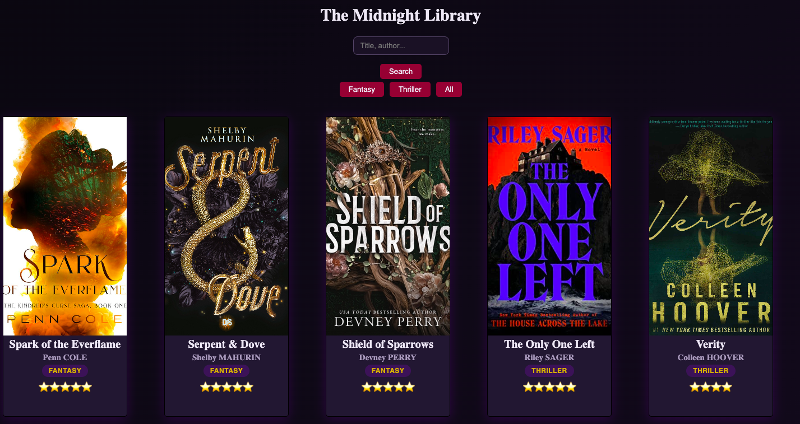

# The Midnight Library

Une application React pour gérer sa bibliothèque Fantasy/ Thriller personnelle : rechercher des livres via l'API Open Library, les ajouter à sa collection, les noter, les organiser par genre, et les supprimer. Les données sont sauvegardées dans le `localStorage` du navigateur.

## Démo

[the-midnight-library-rho.vercel.app](https://the-midnight-library-rho.vercel.app)

## Capture d'écran



## Fonctionnalités

- **Recherche de livres** via l'API [Open Library](https://openlibrary.org/developers/api), avec ajout direct à la bibliothèque
- **Ajout manuel** d'un livre (titre, auteur, genre, note, image de couverture via URL, résumé) avec validation des champs obligatoires
- **Suppression** d'un livre, avec confirmation avant suppression
- **Filtrage par genre**
- **Fiche détaillée** d'un livre dans une fenêtre modale (résumé, couverture, auteur)
- **Persistance des données** entre les sessions grâce à `localStorage`

## Stack technique

- [React](https://react.dev/) 19
- [Vite](https://vite.dev/) — build tool et serveur de dev
- CSS pur (pas de framework)
- [Open Library API](https://openlibrary.org/developers/api) pour la recherche de livres

## Installation

```bash
git clone https://github.com/chloeberthelot/The-Midnight-Library.git
cd The-Midnight-Library
npm install
```

## Lancer le projet en local

```bash
npm run dev
```

L'application est ensuite disponible sur [http://localhost:5173](http://localhost:5173).

## Autres commandes disponibles

```bash
npm run build      # build de production
npm run preview    # prévisualiser le build de production
npm run lint        # vérifier le code avec ESLint
```

## Pistes d'amélioration

- Édition d'un livre déjà ajouté à la bibliothèque
- Système de favoris
- Tri (par note, par titre, par date d'ajout...)
- Tests automatisés

## Auteur

Chloé Berthelot
